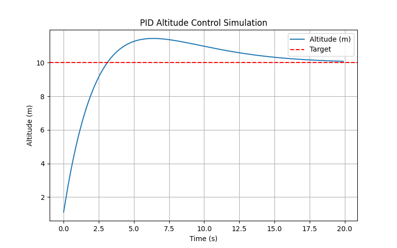

# DJI UAV Challenge

This repository presents an experimental study on **PID control tuning** and **flight log analysis** in the context of the DJI UAV Challenge.  
The project demonstrates how UAV flight stability can be quantitatively evaluated and improved using classical control theory.

---

## Motivation

In UAV applications, maintaining stable altitude and attitude is critical for safe and efficient flight.  
However, manual tuning of PID (Proportional–Integral–Derivative) parameters is often a trial-and-error process, prone to instability and overshoot.  

This project provides:
- A **simulation-based framework** to test PID controllers.
- A **data-driven approach** to analyze flight logs and visualize UAV responses.
- A reproducible workflow for UAV control experiments.

---

## Features

- 🛠 **PID Controller Simulation** (`simulate_pid.py`):  
  Models UAV altitude control under different PID settings.
- 📊 **Flight Log Analysis** (`analyze_log.py`):  
  Processes real/simulated flight logs to evaluate control performance.
- 📈 **Visualization**:  
  Generates plots of response curves, stability, and overshoot.
- 🔬 **Research-oriented workflow**:  
  Enables reproducible experiments for UAV control tuning.

---

## Project Structure

---

## Example Results

### PID Simulation
This figure shows the simulated response of the UAV altitude control using a PID controller:

